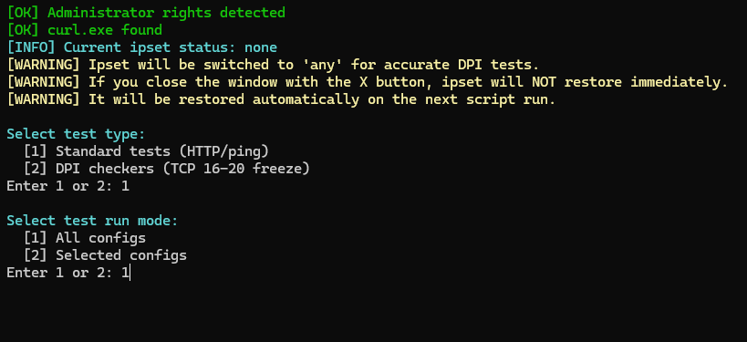
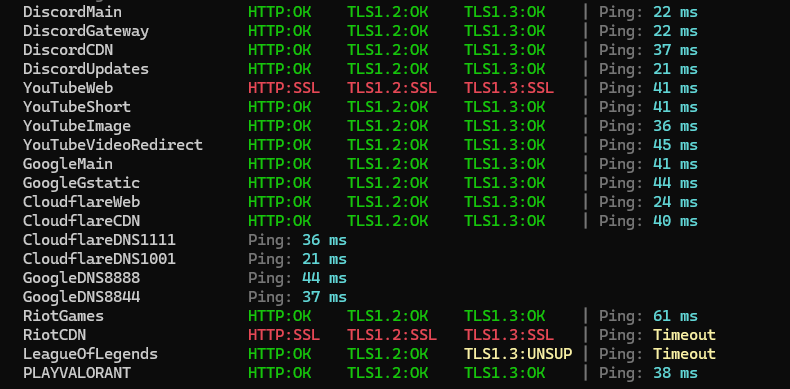

# Как исправить ошибку VAL 43 в Valorant?

**Код ошибки VAL 43** в Valorant означает **сбой связи между игровым клиентом и серверами Riot Games**. Из-за этого игра намертво зависает на экране загрузки, а в некоторых случаях не загружается и Riot Client.

---

## Настройка Zapret под VALORANT

1. **Скачайте актуальную версию** сборки [отсюда](https://github.com/Flowseal/zapret-discord-youtube/releases/tag/1.10.3), если она у вас еще не установлена.
2. **Уберите игру из zapret/lists** откройте файл `list-exclude.txt` и удалите из него следующие 4 домена, если они там присутствуют:
   * `riotgames.com`
   * `riotcdn.net`
   * `leagueoflegends.com`
   * `playvalorant.com`
3. **Добавьте домены в zapret/lists** откройте файл `list-general-user.txt` и вставьте эти же 4 домена туда.
4. **Добавьте тестовые адреса в файл с таргетами:** откройте файл `utils/target.txt`, пролистайте в самый конец и добавьте следующий блок кода:
   ```text
   ### VALORANT and RIOTCLIENT
   RiotGames             = "https://riotgames.com"
   RiotCDN               = "https://riotcdn.net"
   LeagueOfLegends       = "https://leagueoflegends.com"
   PLAYVALORANT          = "https://playvalorant.com"
   ```
5. **Сохраните изменения** во всех отредактированных текстовых файлах.

### Тестирование и выбор стратегии

Перед тем как создавать или запускать службу, обязательно проверьте конфигурацию:

1. Запустите скрипт `sevice.bat` и нажмите 2. Remove Service (если служба уже была создана) или сразу перейдите к тестам.
2. Запустите проверку с помощью команды **Run Tests** в интерфейсе утилиты.
3. 
4. Программа начнет подбирать стратегии обхода. Вам нужно дождаться окончания теста.
5. Убедитесь, что ваш *Best Strategy* успешно открывает доступ к игровым доменам. В строках `RiotGames` и `PLAYVALORANT` должны появиться зеленые статусы и пинг.



6. После успешного теста **создайте службу** (`service.bat`) "1. Install Service" и выберите там стратегию или запустите соответствующий `.bat` файл с выбранной стратегией.

